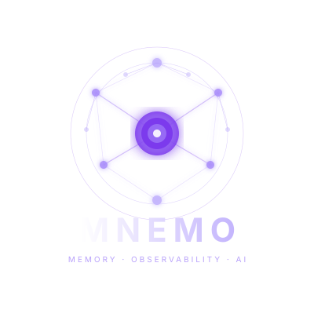

<p align="center">
  
</p>

<h1 align="center">Mnemo</h1>

<p align="center">
  <strong>Memory and observability for AI agents.</strong>
</p>

<p align="center">
  Every AI framework teaches agents to think. Nobody taught them to remember. Until now.
</p>

<div align="center">

[](https://pypi.org/project/mnemo-sdk/)
[](https://github.com/DharmaDhillon/mnemo)
[](LICENSE)
[](https://www.python.org/downloads/)

`pip install mnemo-sdk[all]`

</div>

---

```python
from mnemo import MnemoClient
from mnemo.client import LLMConfig

mnemo = MnemoClient(
    tenant_id="my-company",
    llm=LLMConfig(provider="anthropic", model="claude-sonnet-4-20250514"),
)

result = mnemo.run(agent_id="my-agent", prompt="Help the user with their refund")

print(result.response)           # Claude's response
print(result.memories_injected)  # memories from past runs injected into this call
print(result.trace_url)          # clickable Langfuse trace URL
```

That's it. Your agent now remembers every past interaction, has full trace visibility, and fires alerts when behavior deviates.

## What is Mnemo?

Mnemo is a **drop-in layer** that gives any AI agent persistent memory and full observability. Not a framework. Not a replacement for your existing stack. A few lines of code on top of whatever you already use.

| Without Mnemo | With Mnemo |
|---|---|
| `response = claude.complete(prompt)` | `result = mnemo.run(agent_id="bot", prompt=prompt)` |
| Agent forgets everything between runs | Agent remembers every past interaction |
| No visibility into what it decided or why | Full trace of every decision in a dashboard |
| Same mistakes repeated forever | Learns from failure patterns over time |
| No alerts when things go wrong | Smart alerts on latency, errors, amnesia |

## What's Working Today

These features are **tested and working** in v0.1.0-alpha:

- **Anthropic Claude integration** — full memory + tracing
- **OpenAI integration** — full memory + tracing
- **Custom LLM support** — pass any function via `LLMConfig(call_fn=...)`
- **Mem0 memory** — episodic, semantic, and pattern memory across runs
- **Langfuse tracing** — every run produces a clickable trace URL
- **OpenTelemetry emission** — traces to Datadog, Grafana, CloudWatch
- **Smart alerts** — latency, missing memories, error rates, custom rules
- **Multi-tenant isolation** — tenant_id scoping on every operation
- **HIPAA/FERPA/COPPA compliance mode** — hashed audit logs, retention policies
- **Supabase schema** — full database with RLS policies ready to deploy

## Coming Soon

- **Next.js dashboard** — visual trace explorer, memory browser, alert config
- **LangChain integration** — callback handler for automatic memory + tracing
- **CrewAI / Google ADK integrations**
- **Docker self-host** — `docker-compose up` one-command deploy

## Install

```bash
pip install mnemo-sdk[all]
```

Or install from source:

```bash
git clone https://github.com/DharmaDhillon/mnemo
cd mnemo
pip install -e "sdk/python[all]"
```

Set up your environment:

```bash
cp .env.example .env
# Edit .env and add your keys:
#   MNEMO_MEM0_API_KEY        — from https://mem0.ai
#   MNEMO_LANGFUSE_PUBLIC_KEY — from https://langfuse.com
#   MNEMO_LANGFUSE_SECRET_KEY — from https://langfuse.com
#   ANTHROPIC_API_KEY         — from https://console.anthropic.com
```

## Quick Start

### Use with Claude

```python
from dotenv import load_dotenv
load_dotenv()

from mnemo import MnemoClient
from mnemo.client import LLMConfig

mnemo = MnemoClient(
    tenant_id="acme-corp",
    llm=LLMConfig(provider="anthropic", model="claude-sonnet-4-20250514"),
)

result = mnemo.run(
    agent_id="support-bot",
    prompt="The user wants to cancel their subscription",
    user_id="user-123",
)

print(result.response)
print(f"Memories used: {result.memories_injected}")
print(f"New memories:  {result.memories_created}")
print(f"Trace:         {result.trace_url}")
```

### Use with OpenAI

```python
mnemo = MnemoClient(
    tenant_id="acme-corp",
    llm=LLMConfig(provider="openai", model="gpt-4o"),
)

result = mnemo.run(agent_id="analyst", prompt="Summarize Q4 revenue trends")
```

### Use with any LLM

```python
def my_llm(enriched_prompt):
    # Call whatever you want — local model, API, anything
    return my_model.generate(enriched_prompt["prompt"])

mnemo = MnemoClient(
    tenant_id="acme-corp",
    llm=LLMConfig(provider="custom", call_fn=my_llm),
)
```

### Integration helpers

```python
# One-line Claude agent
from mnemo.integrations.claude import run_with_claude

result = run_with_claude(
    tenant_id="acme-corp",
    agent_id="support-bot",
    prompt="Help the user",
)

# One-line OpenAI agent
from mnemo.integrations.openai import run_with_openai

result = run_with_openai(
    tenant_id="acme-corp",
    agent_id="analyst",
    prompt="Summarize Q4 trends",
)
```

### Healthcare Compliance (HIPAA)

```python
from mnemo.compliance import ComplianceMode

mnemo = MnemoClient(
    tenant_id="hospital-abc",
    compliance_mode=ComplianceMode.HIPAA,
)

# Every run is now:
# - Tagged with HIPAA framework
# - Logged with decision audit trail (prompts stored as hashes, not raw text)
# - Subject to 6-year retention policy
# - Exportable for regulators

report = mnemo.compliance.export_audit_json(agent_id="triage-bot")
```

## Architecture

```
Your Agent Code
       |
       v
   MnemoClient
       |
  +----+----+
  v    v    v
Mem0  Langfuse  OpenTelemetry
  |    |         |
  v    v         v
Memory  Dashboard  Datadog/Grafana/CloudWatch
```

Mnemo doesn't rebuild these tools — it orchestrates them. Mem0 handles memory storage. Langfuse handles trace collection. OpenTelemetry handles enterprise observability. Mnemo is the intelligent bridge.

## Memory Types

| Type | What it stores | Example |
|---|---|---|
| **Episodic** | What happened in past runs | "User asked about refunds 3 times last week" |
| **Semantic** | Facts about the domain/users | "This user is on the Enterprise plan" |
| **Pattern** | Learned success/failure modes | "Asking for order ID first reduces resolution time by 40%" |

## How It Works

When you call `mnemo.run()`, seven things happen:

1. **Retrieve** — fetches relevant memories from Mem0 based on the prompt
2. **Inject** — adds those memories into the prompt context via `<agent_memory>` tags
3. **Call** — sends the enriched prompt to your LLM (Claude, OpenAI, or custom)
4. **Trace** — logs every step to Langfuse + OpenTelemetry
5. **Extract** — analyzes the response and stores new memories in Mem0
6. **Alert** — evaluates alert rules (latency, errors, amnesia) and fires if triggered
7. **Return** — gives you back the response with full metadata

## Pricing

| Tier | Price | What you get |
|---|---|---|
| **Open Source** | Free forever | SDK + self-host (MIT license) |
| **Cloud Solo** | $29/mo | Hosted dashboard, no server needed |
| **Cloud Teams** | $99/mo | Unlimited agents, pattern detection AI |
| **Enterprise** | $500-2000/mo | HIPAA/FERPA compliance, SSO, audit trail |

## Project Structure

```
mnemo/
  sdk/python/mnemo/         Python SDK (pip install mnemo-sdk[all]        # from PyPI (once published)
# — or install from source —
pip install -e "sdk/python[all]")
    client.py               MnemoClient — the core class
    memory.py               Mem0 integration
    tracer.py               Langfuse + OpenTelemetry
    alerts.py               Alert detection engine
    compliance.py           HIPAA/FERPA/COPPA mode
    integrations/           Ready-to-use provider wrappers
      claude.py             Anthropic Claude
      openai.py             OpenAI
      langchain.py          LangChain (coming soon)
  sdk/typescript/           TypeScript SDK (coming soon)
  api/                      FastAPI backend
  dashboard/                Next.js dashboard (coming soon)
  db/schema.sql             Supabase schema + RLS policies
```

## Contributing

See [CONTRIBUTING.md](CONTRIBUTING.md) for setup instructions and guidelines.

## License

[MIT](LICENSE)
